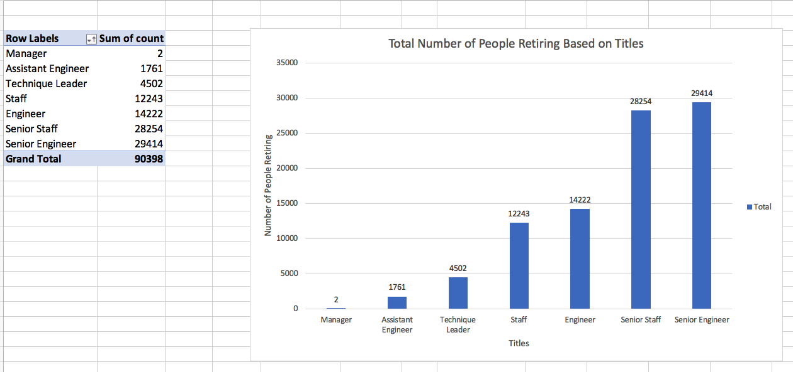
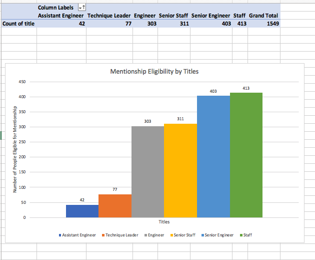

# Pewlett-Hackard-Analysis

## Overview of the Analysis
---
### Basic Tools
This project uses PostgreSQL server and pgAdmin management platform to create schema and run queries. When there are large amount of data that excel or python fails to process, databases come in handy. With relationship database, tables of data can be easily manipulated to meet the needs of a certain search or analysis. 

### Project Goal
The goal of Pewlett-Hackard analysis is to have the required retiring employees’ information provide them to the manager for further decision making.
 *  The Number of Retiring Employees by Title
    
    Tips: Find retiring employees within a certain birth_date, and join the relevant tables without duplicated employee IDs. Use aggregation to calculate total number of retiring employees for each job title. Create a new temporary table to hold the data and export into a csv file.

 * The Employees Eligible for the Mentorship Program

    Tips: Find employees with their basic information and retrieve more columns from other tables with the help of ERD (Entity Relationship Diagram) to join tables with conditions applied as needed.

## Results
---

From the above two deliverables defined in the project goal section, below are the major points concluded. Pivot table and chart are used to visualize the data.

1. From Retiring Employees by Title csv File (see Graph A below)
    * retiring_titles.csv file has shown that the top position in need is Senior Engineers after the wave of retirement of employees within the company.
    * There will be 2 manager positions that needs to be filled in. Assistant Engineer, Technique Leader, Staff, Engineer, Senior Staff have positions open with an increasing total number of needs to compensate the retirement gaps.
    
        
        Graph A

         

        
        Graph B

2. Mentorship Eligibility csv File (see Graph B above)
    * Staff and Senior Engineer job titles have the highest amount of qualifying mentors. Whereas Assistant Engineer and Technique Leader positions have the least qualifying people in the mentorship program.
    * Apart from Manager position, all other job title has mentors available to train the new employees to get ready for the position. 

## Summary
---

* Run the query below, the total number of roles that needs to be filled is 90398.
  
        SELECT COUNT(title) FROM unique_titles;

* For all the roles other than managers role, there are qualifying mentors available to train the new hires. However there is not a single manager who's qualified in the mentorship program. 

    Run the query below to see the titles and total number of people available for the mentorship program for each role.
        
        SELECT COUNT(emp_no) AS count, title 
        FROM mentorship_eligibility
        GROUP BY title
        ORDER BY count ASC;

    In Addition, from Graph A and B above, calculations are done for the mentor mentee ratio for all roles: the ratio is between 1:90 on Senior Staff (1 mentor Senior Staff, 90 mentees Senior Staff) to 1:30 on Staff position.